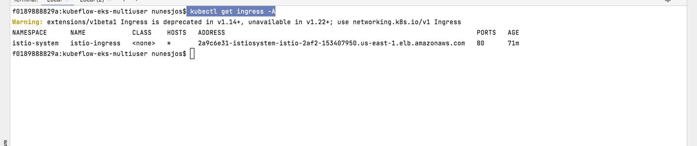

# Building multi-user isolation in Kubeflow on Amazon EKS using Amazon Cognito and ADFS.

##  Description

he Kubeflow project (https://www.kubeflow.org/) is dedicated to making deployments of machine learning (ML) workflows on Kubernetes simple, portable and scalable. The project’s goal is not to recreate other services, but to provide a straightforward way to deploy best-of-breed open-source systems for ML to diverse infrastructures. In this blogpost, we will explore how to deploy Kubeflow on Amazon Elastic Kubernetes Service (https://aws.amazon.com/eks/) and how to achieve multi-user isolation using Amazon Cognito and ADFS. A lot of our enterprise customers have the necessity to integrate Kubeflow with their existing authentication mechanism and we will walk you through the process of achieving this using Amazon Cognito and ADFS to achieve isolation of notebooks, experiments etc. between various users/user groups. To get an overview of Kubeflow multi-tenancy please refer the documentation here (https://www.kubeflow.org/docs/components/multi-tenancy/).

## Architecture

The above diagram depicts the following workflow.

1. User opens the custom URL for the Kubeflow ALB
2. Route53 resolves the FQDN to the ALB
3. ALB redirect the request to the kubeflow containers running on EKS
4. IstioGateway intercepts the request
5. IstoGateway redirects the request to cognito
6. Cognito App client is configured with a custom Domain and valid certificate from Amazon Certificate Manager
7. Cognito redirects the request to the configured IDP provider (ADFS in this example)
8. User logs in and ADFS redirects to Cognito with the SAML assertion
9. Cognito has the Pre-Token generation event configured to trigger the Lambda function
10. “Profile Manager” Lambda is triggered with the groups that the user bellongs in the AD as part of the event
11. Lambda, based on the groups received on the event will connect to the Amazon EKS and generate the necessary role and serviceRoleBindings
12. Cognito redirect back to the Kubeflow UI

## Instructions

This Terraform module assumes some resources already exist and it has parameters to fill with those.

Change the Parameters in the file terraform.tfvars and run terraform apply

#### Prerequisites

In order to build this solution, you will need access to the following.

* AWS account
* Amazon Certificate Manager (ACM) certificate and a valid domain 
* Knowledge about Amazon Cognito, Identity providers and Federation and Kubernetes/Amazon EKS
* eksctl
* Minimal knowledge in other AWS services like Route53, and AWS Lambda
* Kubeflow basic administration knowledge. 
* ADFS Claims configured to support the Amazon Cognito Configuration 
* ADFS environment:
  * To configure Microsoft Active Directory with Federation services, please follow [this](https://aws.amazon.com/blogs/security/enabling-federation-to-aws-using-windows-active-directory-adfs-and-saml-2-0/) guide.  

#### Requirements
* VPC with 2 private subnets
* ADFS
  * saml-metadata.xml.tpl needs to be replaced with your ADFS metadata xml file 
* Route53 Custom Domain (Mandatory, self-signed certificate will not work)
* Kfctl and aws-iam-authenticator in the PATH(this is used by terraform to install kubeflow)

#### Required parameters
* region                      = us-east-1
* account_id                  = <account_id>
* vpc_id                      =   <vpc_id>
* kms_key_arn                 =   <kms_ley>
* eks_name                    =   "kubeflow-DEMO"
* iam_role_prefix             =   "kubeflow"
* iam_poliy_prefix            =   "kubeflow"
* cpu_worker_type             =   "m5.large"
* route53_domain              =   "kubeflow-DEMO.<customDomain>"
* cert_alt_names              =   ["auth.kubeflow-DEMO.<customDomain>","cognito.auth.kubeflow- DEMO.<customDomain>","kubeflow.kubeflow-DEMO.<customDomain>"]
* auth_base_domain            =   "auth.kubeflow-DEMO.<customDomain>"
* cognito_domain              =   "cognito.auth.kubeflow-DEMO.<customDomain>"
* kubeflow_domain             =   "kubeflow.kubeflow-DEMO.<customDomain>"
* associate_public_ip_address =   true
* nodegroup_min_size          =   1
* nodegroup_max_size          =   6
* nodegroup_desired_size      =   6
* ssh_key_name                =   <MyKey>
* adfs_url                    =   <ADFS address>
* lambda_concurreny_enabled   =   false
* lambda_profile_concurrency  =   10
* tags                        = {}
* env                         = "<Environment>"  

# Instructions
## Terraform
* create the an s3 bucket and dynamodb for terraform to store the lock and information about the stack
* configure the providers to set the bucket
* create your domain on Route53, need to be public and valid
* configure terraform.tfvars to add the variables
* Init the stack
  * terraform init
* Run terraform
  * terraform apply -auto-approve
* Get the ALB ingress from kubernetes
  * kubectl get ingress -A
  * 
* Create the Route53 entry pointing to this cname
  * it should be kubeflow.<domain> pointing to the ELB